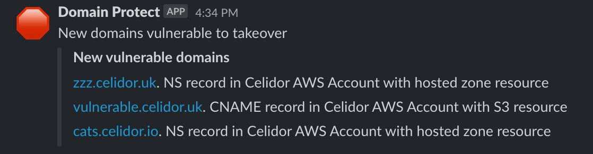

---

layout: col-sidebar
title: OWASP Domain Protect
tags: domain-protect
level: 2
type: tool
pitch: Protect against subdomain takeover

---

Attackers can take over an organisation's subdomains, and use them for reputational damage, malware hosting and credential harvesting.
Subdomain takeover is particularly common for organisations hosting their applications and infrastructure in the cloud.

**Domain Protect** helps to prevent subdomain takeover, using serverless functions in AWS or GCP to continually scan an organisation's DNS records. 
When vulnerable subdomains are found, it sends alerts via Slack or email, and optionally creates cloud resources to take over subdomains before attackers or bug bounty researchers.

