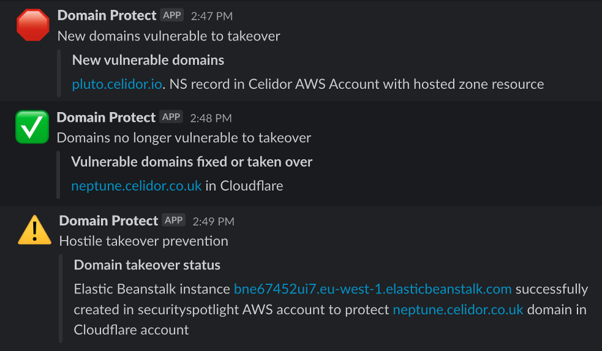

---

layout: col-sidebar
title: OWASP Domain Protect
tags: domain-protect
level: 2
type: tool
pitch: Protect against subdomain takeover

---

Attackers can take over an organisation's subdomains, using them for reputational damage, malware hosting and credential harvesting.
Subdomain takeover by bug bounty researchers is particularly common for organisations hosting their applications and infrastructure in the cloud.

**Domain Protect** helps to prevent subdomain takeover, using serverless functions in AWS or GCP to continually scan an organisation's DNS records. 
When vulnerable subdomains are found, it sends alerts via Slack or email, and optionally creates cloud resources to take over subdomains before attackers or bug bounty researchers.

### Contributing

We very much welcome contributors to the project, and we're also looking for more Project Leaders.

Working on Domain Protect is a great way to improve your skills in Python and Terraform development, increase your knowledge and experience of serverless across different cloud providers, and enhance your reputation within the security community.

The first step is to get in touch with the Project Leader [Paul Schwarzenberger](mailto:paul.schwarzenberger@owasp.org) at OWASP Slack channel #project-domain-protect or by email.

### Deployment

Deploy Domain Protect to your AWS environment using Terraform

or to GCP

Installation options detailed in [installation documentation](https://github.com/domain-protect/domain-protect/blob/main/docs/installation.md)

We recommended deployment using GitHub Actions with [Domain Protect Deploy](https://github.com/domain-protect/domain-protect-deploy)

### Manual Scans

Penetration testers and those evaluating Domain Protect can use [manual scans](https://github.com/domain-protect/domain-protect/blob/main/manual_scans/aws/README.md) in AWS, GCP or Cloudflare to identify vulnerabilities from their laptop with no installation of cloud infrastructure.

